import DemoVideo from "../../../assets/rdt-demo.mkv";

Finding the right code is crucial for patches and understanding how to do specific things.

Whenever you need to find something, think about whether there is a UI element inside Discord that does what you want.
For example, let's say you want to know how to delete a message with code. All you have to do is inspect what the "Delete Message" button or context menu option do.

There are multiple methods for finding the relevant code. I'll demonstrate all of them via a practical example:

- [Searching by text](#searching-by-text)
- [React Developer Tools](#react-developer-tools)

## React Developer Tools

React DevTools are like the Element inspector, but for React components. They allow you to inspect the component hierarchy, view props and state, and understand how the UI is structured and behaves.
We can use it to inspect any element and see its inner workings, which is especially useful for inspecting interactive elements and accessing their event handlers like onClick, onContextMenu, etc.

First, you need to enable it.

1. Open `Settings > Vencord`
2. Enable the `Enable React Developer Tools` switch.
3. Restart Discord.
4. In the top bar of DevTools, you will now have a new "Components" tab. It may be hidden behind the `>>` overflow menu if your window is not wide enough.

:::note
Currently Electron has a bug which may cause this tab to not show up. In that case, reload Discord once via `CTRL + R` and it should show up.
:::

---

As practical example, let's use React DevTools to find out how to join a voice channel programmatically.

The most obvious UI element for this are voice channels in the channel list. Clicking them causes you to join.

Use the Element Picker to select the voice channel element in the Discord UI.
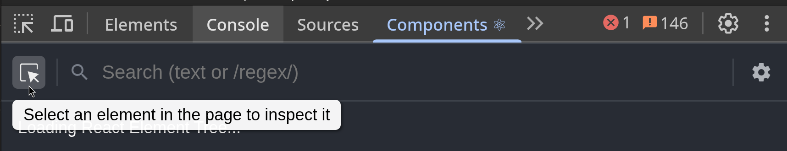

This will highlight the corresponding React component tree in the DevTools. Now click around a bit to find the exact component that contains the onClick handler.
While doing this, pay attention to the Discord UI to see which element gets highlighted to ensure you're not going too far.

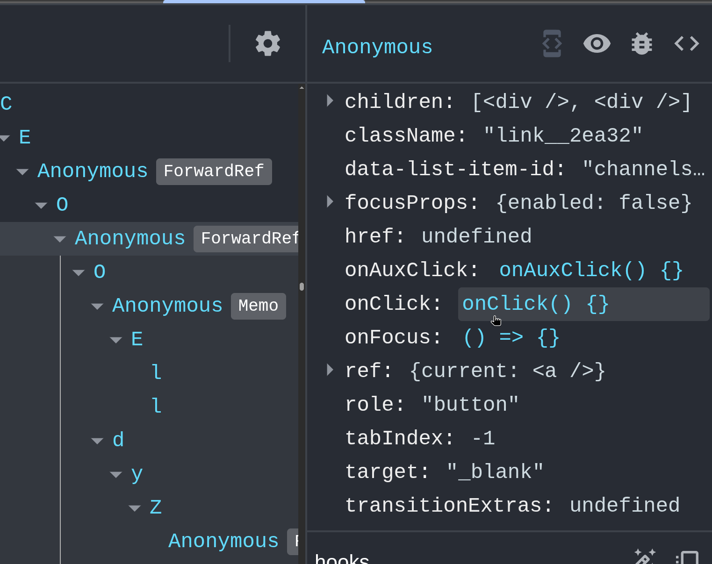
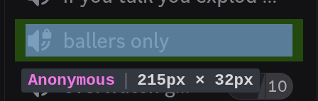

Then click the `onClick` to jump to the corresponding javascript code. You can now read the surrounding code to understand how the action is implemented.

It also really helps to

- set a breakpoint in the `onClick` handler
- click the voice channel element to trigger the handler
- now execution should pause and you should be able to inspect all variables, the call stack, etc.

### Full Demonstration

<video controls width="100%">
    <source src={DemoVideo} type="video/x-matroska" />
</video>

## Searching by text

The Sources tab in the DevTools allows you to search for text within the entire javascript codebase. To do so, open the Sources tab and press `CTRL + SHIFT + F` (or `CMD + SHIFT + F` on Mac).

Often times, it's easy to find relevant code by searching for either

- [Strings](#searching-by-strings) — the text displayed in the UI (e.g., button labels, menu items)
- [CSS Classes](#searching-by-css-classes--ids) — class names used on elements

### Searching by Strings

As an example, let's find the "Share my activity" setting.

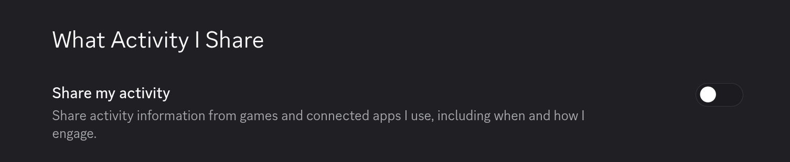
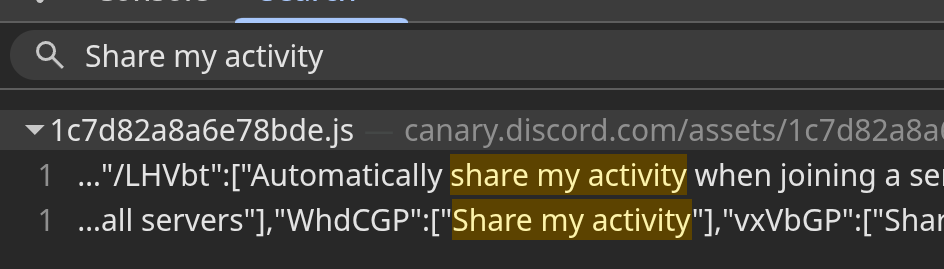

The first search result is an unrelated String.

`"WhdCGP":["Share my activity"]` is our target string. Since Discord supports multiple languages, each string is stored in a central place with a unique ID; In this case `"WhdCGP"`.

Next we will search for this ID to locate where this string is used in the code. You can then jump to the results and see the code and set breakpoints.

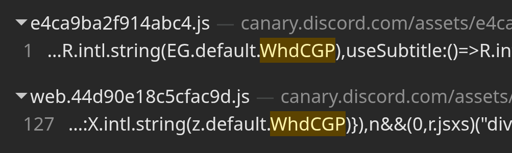
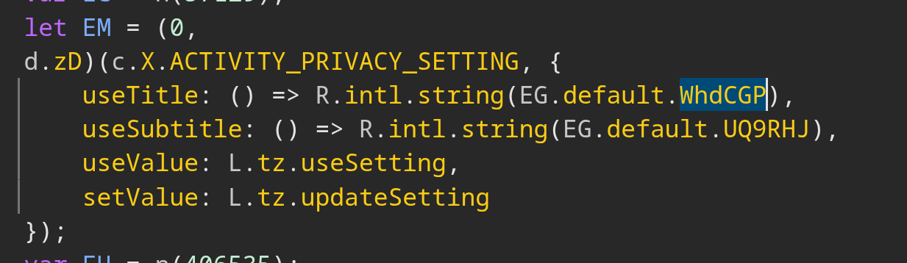
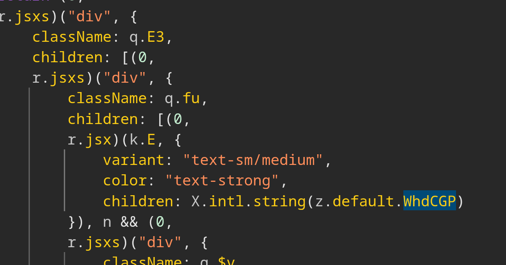

:::note
You may see duplicate results, with one being called something like `WebpackModule867730` and the other one being called something like `e4ca9ba2f914abc4.js`.

What this means is that the [module](../modules#modules) this code is in was patched by a plugin. Whenever a module is patched, it is extracted into its own file called `WebpackModuleXXXXXX`.

So the first result is the actual module in use. The second result is the [chunk](../modules#chunks) this module was contained in. However the module in this chunk is no longer used.
:::

### Searching by CSS Classes / IDs

Sometimes it's helpful to search for CSS classes or IDs. This is especially useful for Context Menus, which all have an ID.

Use the DevTools Element Picker in the top left to select the element you want to inspect. Look for a unique CSS class or ID that you can search for in the Sources tab

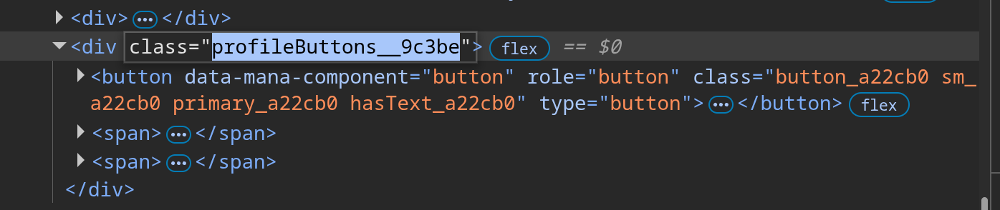

Now search for this CSS class or ID in the Sources tab. You might find a `.css` file — ignore it. Instead, focus on the `.js` result.

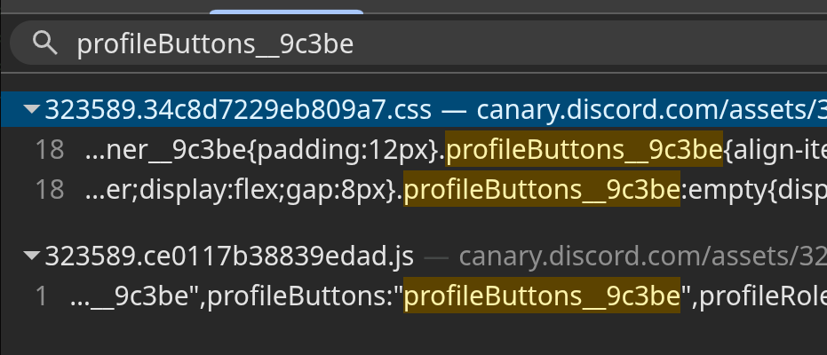
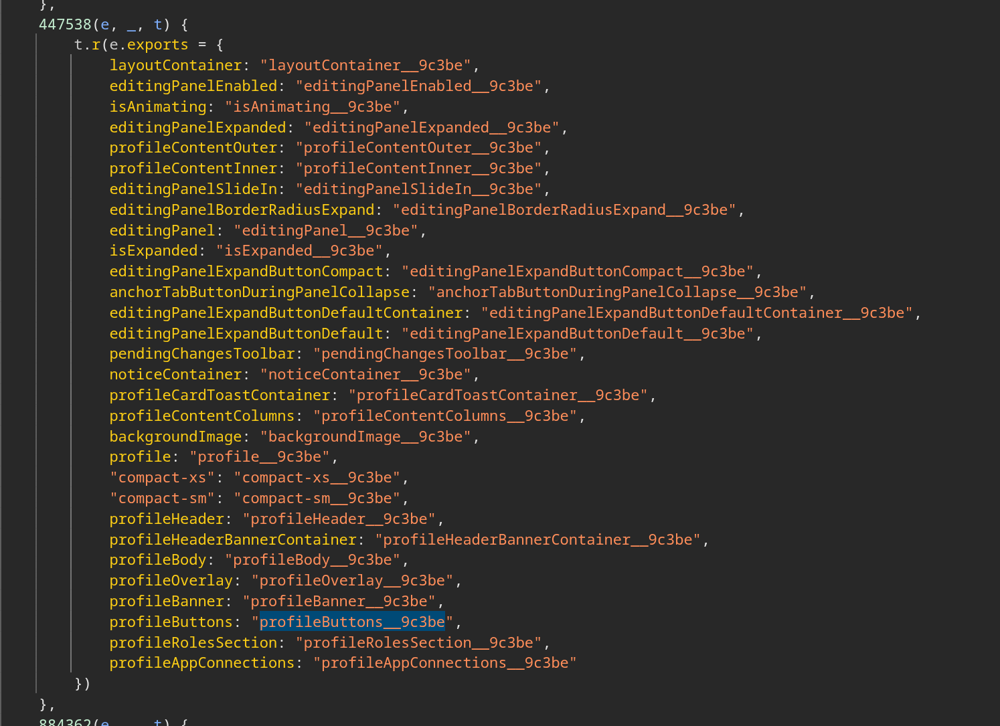

You will notice that this is only a small [module](../modules#modules) which exports one or more css classes. The export names may be short one or two letter names.
If so, take note of the mangled export name corresponding to the CSS class you are interested in.

Now look for the ID of this module, in our case it's `447538`.
If you are confused, see the [modules](../modules#modules) documentation for more information.

Search for this ID to find other modules that import this module. In our case, there is one result, which imports the CSS module as `at`.

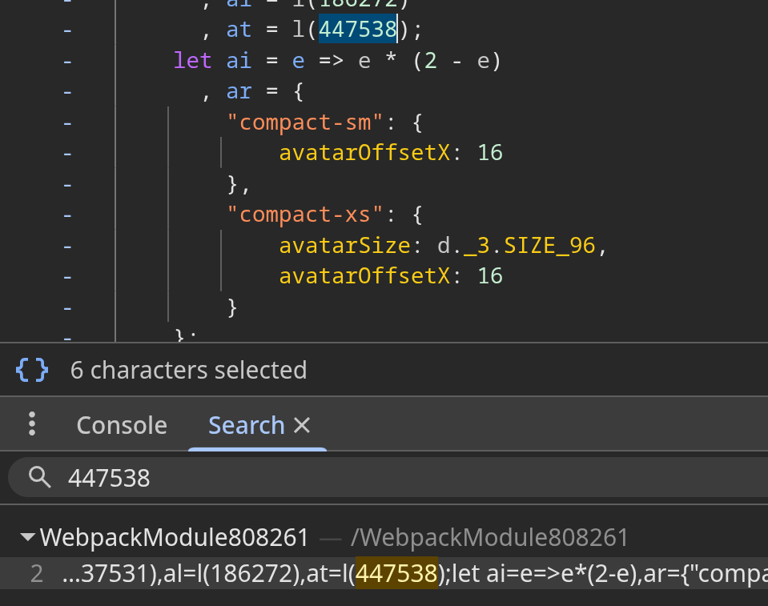

You can now combine the import name `at` with the export name `profileButtons` and search for that in the module.

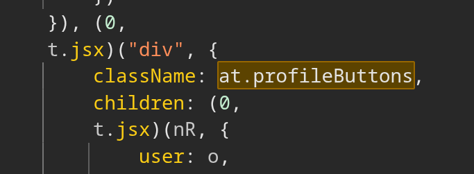
