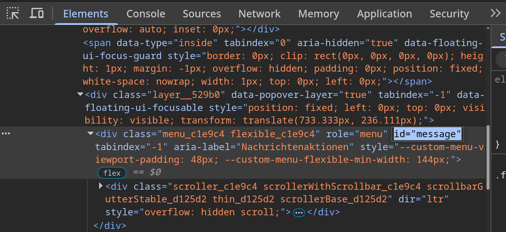
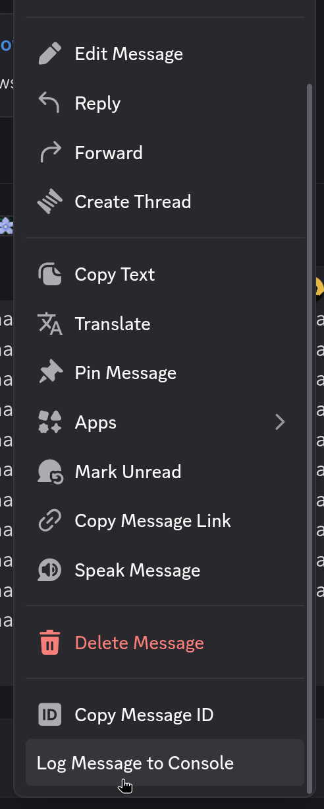
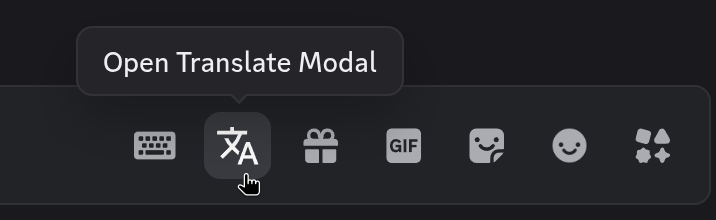
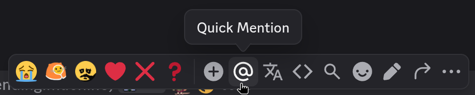
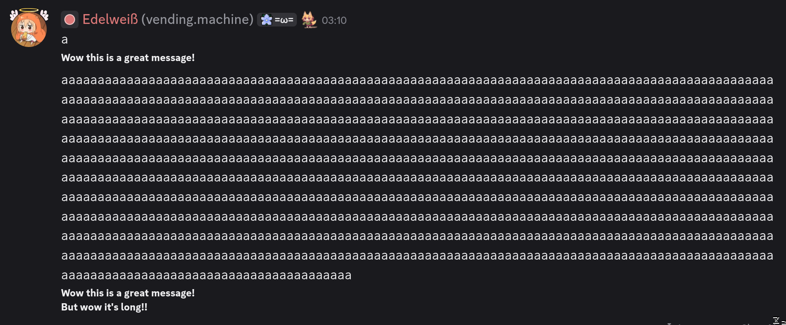
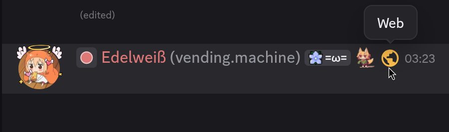
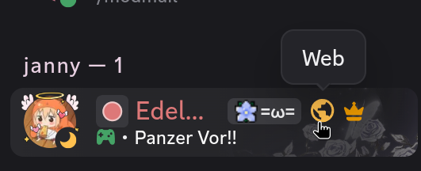

import { Tabs, TabItem } from "@astrojs/starlight/components";

To make plugin development easier, Vencord provides convenient ways to add many elements to your plugin, such as commands, automatic settings management, and UI components.

This doc's purpose is to give a quick overview — It won't explain how to use them in-depth. For more detailed information, look at other plugins that use these APIs.

## Plugin Settings

Define a toggleable plugin setting which will allow users to toggle a feature in your plugin's settings modal;

```tsx
// Define settings. This will return a reactive settings object.
// - To read: `const enableFeature = settings.store.coolFeature`
// - To write: `settings.store.coolFeature = false`
const settings = definePluginSettings({
    coolFeature: {
        type: OptionType.BOOLEAN,
        description: "Enable a very cool feature",
        default: true
    }
});

export default definePlugin({
    name: "MyCoolPlugin",
    // You MUST include your plugin settings in your plugin definition or you will get an error!
    settings
});

function ReactComponent() {
    // Reactive subscription that will automatically update your component when the setting changes
    const { coolFeature } = settings.use(["coolFeature"]);

    return <div>{coolFeature ? "Cool feature is enabled" : "Cool feature is disabled"}</div>;
}
```

## Slash Commands

Register a slash command `/hello-world` that will send the text "Hello World!". Supports most command features like arguments and sub-commands.

```ts
definePlugin({
    name: "MyCoolPlugin",
    commands: [
        {
            name: "hello-world",
            description: "A simple hello world command",
            execute: () => ({ content: "Hello World!" })
        }
    ]
});
```

## Context Menus

Patch Discord's context (right click) menus to add your own options.

Each context menu type (message, user, channel, etc.) has its own ID. The example below targets the message context menu. Its ID is `message`.

<Tabs>
    <TabItem label="index.ts(x)" icon="seti:react">
        ```ts
        definePlugin({
            name: "MyCoolPlugin",
            contextMenus: {
                message(children, props) {
                    children.push(
                        <Menu.MenuItem
                            id="vc-myCoolPlugin-logMessage"
                            key="vc-myCoolPlugin-logMessage"
                            label="Log Message to Console"
                            action={() => console.log(props.message)}
                        />
                    );
                }
            }
        });
        ```
    </TabItem>

    <TabItem label="Finding the ID" icon="seti:code-search">
        - Open Browser DevTools
        - In Discord, right click to open the context menu you want to target
        - Use Inspect Elements to reveal it in the Elements tab
        - Look for its ID in the html

        
    </TabItem>

    <TabItem label="Screenshot" icon="seti:image">
            
    </TabItem>

</Tabs>

## Chat Bar Buttons

Add custom buttons in the chat bar (where Gift, Gif, Sticker and Emoji buttons are)



You define it via the `chatBarButton` property on your plugin object. The icon is used for `Settings > Vencord > Plugins > Manage Plugin UI Elements`.

I'm not going to explain this further, just look at how the SilentTyping and Translate plugins use it.

```ts
definePlugin({
    name: "MyCoolPlugin",
    chatBarButton: {
        icon: IconComponent,
        render: ButtonComponent
    }
});
```

## Message Events

Run code whenever the current user

- **clicks** a message: Define `onMessageClick` on your plugin object
- **sends** a message: Define `onBeforeMessageSend` on your plugin object
- **edits** a message: Define `onBeforeMessageEdit` on your plugin object

## Message Popover Buttons

The message popover is the little bar that appears in the top-right corner of a message when you hover over it.



You define it via the `chatBarButton` property on your plugin object. The icon is used for `Settings > Vencord > Plugins > Manage Plugin UI Elements`.

I'm not going to explain this further, just look at how the QuickMention plugin uses it.

```ts
definePlugin({
    name: "MyCoolPlugin",
    messagePopoverButton: {
        icon: IconComponent,
        render: ButtonComponent
    }
});
```

## Message Accessories

Message accessories are elements that appear below messages in chat, such as embeds.

Define the `renderMessageAccessory` method on your plugin object to make use of this feature. This is the easiest way to add custom elements to messages.

<Tabs>
    <TabItem label="index.ts(x)" icon="seti:react">
    ```tsx
    definePlugin({
        name: "MyCoolPlugin",
        renderMessageAccessory(props) {
            const { content } = props.message;

            return (
                <Paragraph size="sm" weight="bold">
                    <div>Wow this is a great message!</div>
                    {content.length > 1000 && <div>But wow it's long!!</div>}
                </Paragraph>
            );
        }
    });
    ```
    </TabItem>

    <TabItem label="Screenshot" icon="seti:image">
            
    </TabItem>

</Tabs>

## Message Decorations



Message Decorations are quite similar to accessories. But instead of appearing below the message, they appear next to the author's username, next to the clan tag, role icon, etc.

Define the `renderMessageDecoration` method on your plugin object to make use of this feature.

## Member List Decorations



Same as message decorations, except they appear next to members in the member list.

Define the `renderMemberListDecorator` method on your plugin object to make use of this feature.
